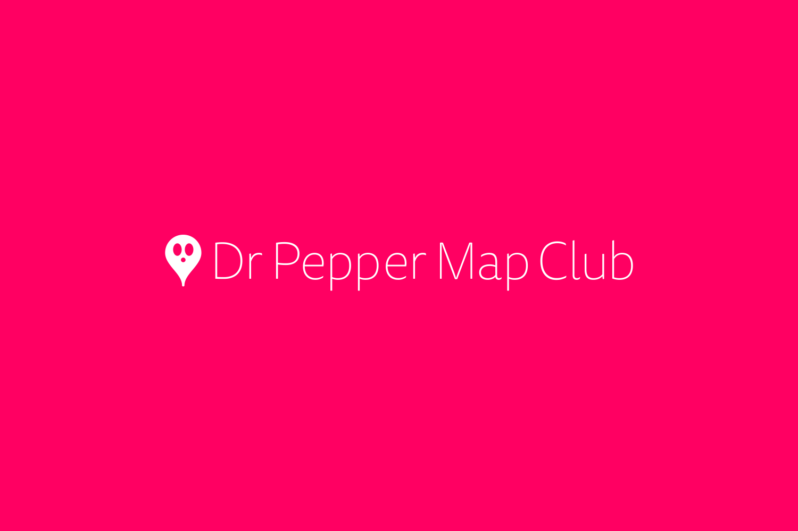

## Dr Pepper Map Club (To Be Developed)

A web app that checks vending machines equipped with Dr Pepper.

## Start

### 1. Firebase & Google Map API

```
  dr-pepper-map-club
  └── .env
```

After creating the .env file, enter the API key as shown below.

`.env`

```env
# Firebase
GATSBY_FIREBASE_API_KEY=******
GATSBY_FIREBASE_AUTH_DOMAIN=******
GATSBY_FIREBASE_DATABASE_URL=******
GATSBY_FIREBASE_PROJECT_ID=******
GATSBY_FIREBASE_STORAGE_BUCKET=******
GATSBY_FIREBASE_MESSAGING_SENDER_ID=******
GATSBY_FIREBASE_APP_ID=******
# Google Map
GATSBY_GOOGLE_API_KEY=******


```

### 2. Firebase Module Install

```shell
npm install firebase-functions@latest firebase-admin@latest --save

npm install -g firebase-tools

firebase login
```

### 3. Develop & Build

```shell
npm install

gatsby build

gatsby develop
```
