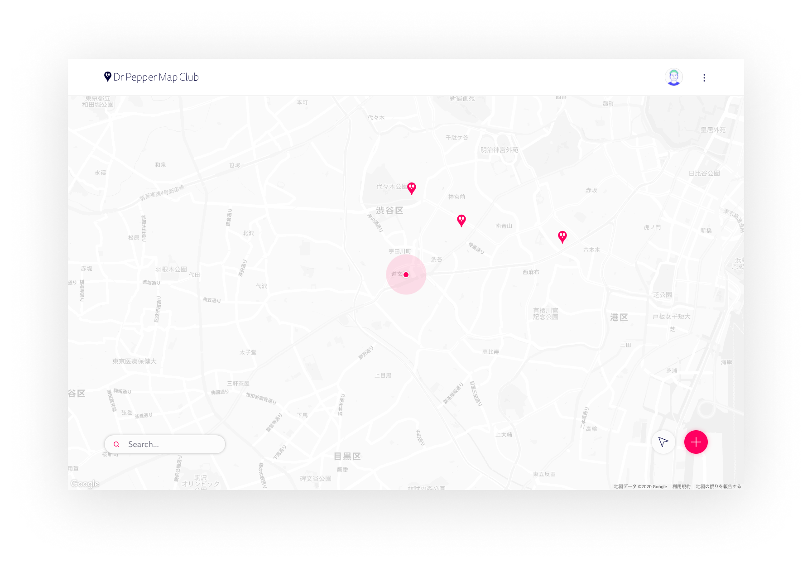

## Dr Pepper Map Club (To Be Developed)

A web app that checks vending machines equipped with Dr Pepper.

## Purpose

Through this web app, you can learn to build a simple service using Firebase, React and TypeScript.

## License

The license for this repository is BSD-3-Clause. You are free to use it, but you may not use it to guarantee or promote products derived from this software. In addition, since the copyright of the logo belongs to the author, any acts such as falsification are prohibited.

## Start

### 1. Firebase & Google Map API

```
  dr-pepper-map-club
  └── .env
```

After creating the .env file, enter the API key as shown below.

`.env`

```env
# Firebase
GATSBY_FIREBASE_API_KEY=******
GATSBY_FIREBASE_AUTH_DOMAIN=******
GATSBY_FIREBASE_DATABASE_URL=******
GATSBY_FIREBASE_PROJECT_ID=******
GATSBY_FIREBASE_STORAGE_BUCKET=******
GATSBY_FIREBASE_MESSAGING_SENDER_ID=******
GATSBY_FIREBASE_APP_ID=******
# Google Map
GATSBY_GOOGLE_API_KEY=******
```

### 2. Install the Firebase modules

```shell
npm install firebase-functions@latest firebase-admin@latest --save

npm install -g firebase-tools

firebase login
```

### 3. Develop & Build

```shell
npm install

gatsby build

gatsby develop
```
